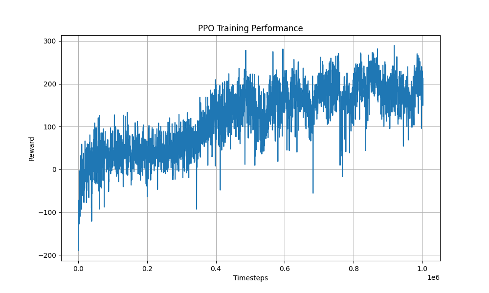

# FarmAI: Reinforcement Learning for Smart Farming in Rwanda

## Project Overview

FarmAI is an AI-powered smart farming platform designed to help smallholder farmers in Rwanda optimize their agricultural practices. This project uses reinforcement learning (RL) to create decision-support tools that address challenges like climate variability, poor soil quality, and water scarcity.

## Problem Statement

Smallholder farmers in rural Rwanda face significant challenges:
- Climate variability and unpredictable weather patterns
- Poor soil quality and degradation
- Water scarcity and inefficient irrigation
- Limited access to real-time agricultural data
- Lack of affordable, context-specific advisory services

These factors contribute to reduced crop yields and food insecurity. FarmAI aims to bridge this gap by providing accessible, data-driven farming recommendations.

## Technical Approach

### Reinforcement Learning Algorithms Implemented

1. **PPO (Proximal Policy Optimization)**
   - Stable, sample-efficient policy gradient method
   - Achieved best performance with 100% success rate

2. **DQN (Deep Q-Network)**
   - Value-based approach with experience replay
   - Achieved 80% success rate

3. **A2C (Advantage Actor-Critic)**
   - Combined policy and value function learning
   - Moderate performance (20% success rate)

4. **REINFORCE**
   - Basic policy gradient method
   - Served as baseline comparison

### Performance Comparison

| Algorithm    | Avg Reward | Success Rate | Steps/Episode |
|--------------|------------|--------------|---------------|
| PPO          | 212.65     | 100.00%      | 365.0         |
| DQN          | 136.19     | 80.00%       | 365.0         |
| A2C          | -7.88      | 20.00%       | 365.0         |
| REINFORCE    | -247.41    | 0.00%        | 365.0         |

## Repository Structure

```
├── environment/            # Custom farming environment
│   ├── custom_env.py       # FarmAI Gym environment
│   └── rendering.py        # Visualization tools
├── training/               # RL training scripts
│   ├── ppo_training.py     # PPO implementation
│   ├── dqn_training.py     # DQN implementation
│   ├── a2c_training.py     # A2C implementation
│   └── reinforce_training.py # REINFORCE implementation
├── evaluation/             # Model evaluation
│   ├── evaluate_models.py  # Performance comparison
│   └── hyperparameter_analysis.py
├── results/                # Training outputs
│   ├── comparisons/        # Model comparison plots
│   ├── gifs/               # Environment visualizations
│   └── videos/             # Agent recordings
├── models/                 # Saved model weights
├── requirements.txt        # Python dependencies
└── main.py                 # Main CLI interface
```

## Key Features

1. **Custom Farm Environment**
   - Simulates Rwandan farming conditions
   - Models soil, water, crop growth dynamics

2. **Multiple RL Implementations**
   - Comparative analysis of different approaches
   - Modular design for easy experimentation

3. **Visualization Tools**
   - Training performance plots
   - Agent behavior recordings
   - Environment visualization

4. **Evaluation Framework**
   - Standardized metrics (reward, success rate)
   - Hyperparameter analysis

## Installation

1. Clone the repository:
   ```bash
   git clone https://github.com/dntwaritag/Denys_Ntwaritaganzwa_rl_summative.git
   cd 
   ```

2. Create and activate virtual environment:
   ```bash
   python -m venv .venv
   source .venv/bin/activate  # Linux/Mac
   .venv\Scripts\activate     # Windows
   ```

3. Install dependencies:
   ```bash
   pip install -r requirements.txt
   ```

## Usage

### Training Models

Train a specific RL algorithm:
```bash
python main.py --train [ppo|dqn|a2c|reinforce]
```

### Evaluating Performance

Compare all trained models:
```bash
python main.py --compare
```

### Visualization

Generate environment visualization:
```bash
python main.py --visualize
```

Record agent behavior:
```bash
python main.py --record [ppo|dqn|a2c|reinforce]
```

## Results

The PPO algorithm demonstrated the best performance with:
- Highest average reward (212.65)
- 100% success rate
- Stable training progression



## Future Work

1. **Real-world Deployment**
   - Integrate with IoT sensors in actual farms
   - Develop mobile interface for farmers

2. **Enhanced Environment**
   - Add more realistic weather patterns
   - Include additional crop types

3. **Advanced RL Techniques**
   - Implement hierarchical RL for multi-season planning
   - Explore meta-learning for adaptation to different farms
